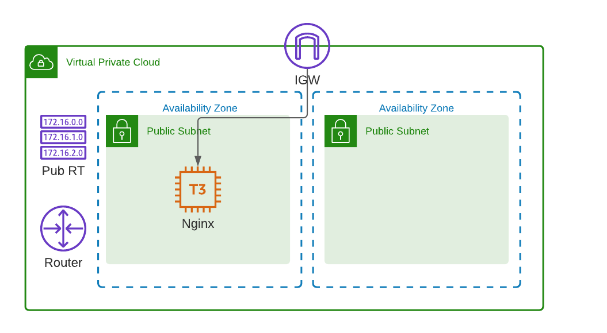

# Terraform I
*This topic is split in two parts.*

HashiCorp Terraform is an infrastructure as code tool that lets you define both cloud and on-prem resources in human-readable configuration files that you can version, reuse, and share. You can then use a consistent workflow to provision and manage all of your infrastructure throughout its lifecycle. Terraform can manage low-level components like compute, storage, and networking resources, as well as high-level components like DNS entries and SaaS features.

## How does Terraform work?
Terraform creates and manages resources on cloud platforms and other services through their application programming interfaces (APIs). Providers enable Terraform to work with virtually any platform or service with an accessible API.

## Manage any infrastructure
Find providers for many of the platforms and services you already use in the Terraform Registry. You can also write your own. Terraform takes an immutable approach to infrastructure, reducing the complexity of upgrading or modifying your services and infrastructure.

## Track your infrastructure
Terraform generates a plan and prompts you for your approval before modifying your infrastructure. It also keeps track of your real infrastructure in a state file, which acts as a source of truth for your environment. Terraform uses the state file to determine the changes to make to your infrastructure so that it will match your configuration.

## Automate changes
Terraform configuration files are declarative, meaning that they describe the end state of your infrastructure. You do not need to write step-by-step instructions to create resources because Terraform handles the underlying logic. Terraform builds a resource graph to determine resource dependencies and creates or modifies non-dependent resources in parallel. This allows Terraform to provision resources efficiently.

## Terraform exercises
Go through the Terraform getting started [docs](https://developer.hashicorp.com/terraform/tutorials/aws-get-started).

### Exercise 1
Create a VPC and deploy an EC2 instance. You can use the [VPC Terraform module](https://registry.terraform.io/modules/terraform-aws-modules/vpc/aws/latest).

### Exercise 2
Add an S3 bucket to your infrastructure. Turn on static website hosting and confirm that you can access it.

### Exercise 3
Create an RDS database instance. SSH to your EC2 instance from the first exercise and prove that you can connect to the database using the mysql CLI.

### Exercise 4 
Use the VPC form Exercise 1 and add an ALB and an ASG.

## Further reading
- "Terraform: Up and Running", 3rd Edition, Yevgeniy Brikman, O'Reilly Media, Inc., ISBN: 9781098116743
- "The Terraform Book", James Turnbull, Turnbull Press
